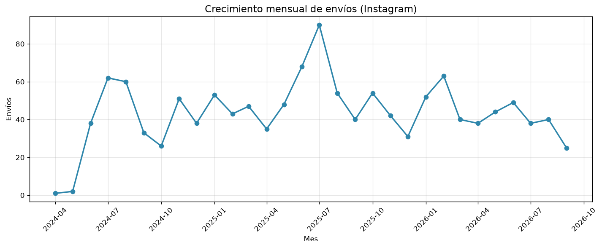
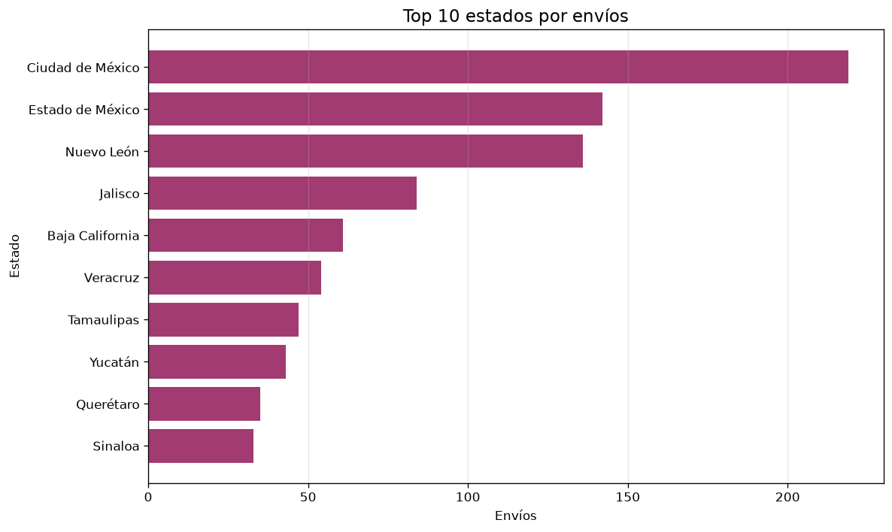
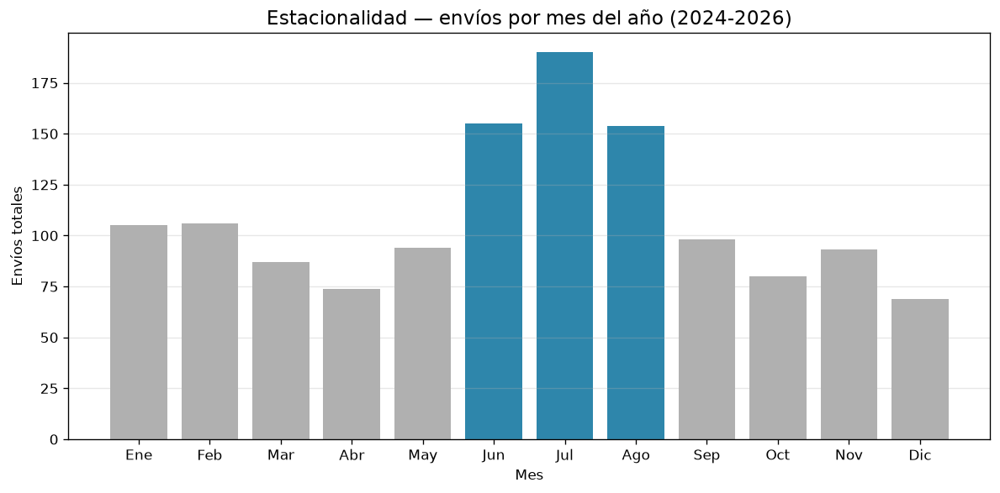
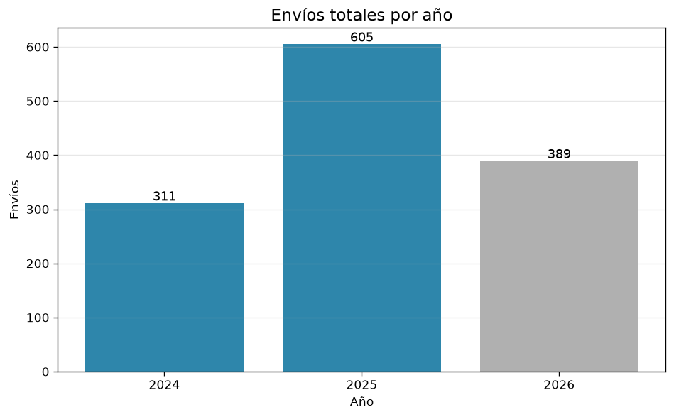
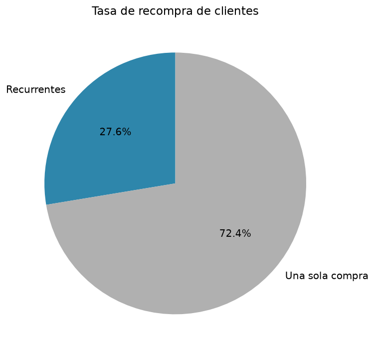

# Análisis de transición: Social Commerce → Ecommerce

Este análisis de datos fue realizado para mi ecommerce Nekoecho que inició
como social commerce en Instagram en 2024 y que recientemente migré a
página web. El proyecto cubre aproximadamente 1,305 envíos registrados
durante 30 meses (abril 2024 – septiembre 2026).

---

## Las preguntas que se responden:

1. ¿Cómo evolucionó el volumen de envíos en 2+ años?
2. ¿Cuál es la distribución geográfica de los clientes?
3. ¿Qué tan recurrentes son los clientes?
4. ¿Hay patrones estacionales claros?

---

## Que Datos use para el analisis?

- **Mi fuente principal:** Formulario de pedidos en Instagram (usando Google Forms para recopilar los datos de envíos).
- **Volumen:** 1,309 filas originales, 1,305 envíos válidos tras limpieza de pruebas.
- **Periodo:** Abril 2024 (Apertura) – Septiembre 2026.
- **Campos:** fecha, usuario de Instagram, paquetería, dirección.

---

## Metodología

### Limpieza (Python + pandas)

Identifiqué y traté los siguientes problemas de calidad:

| Problema | Solución | Resultado |
|---|---|---|
| 3 filas de prueba | Eliminadas | -3 |
| 31 filas completamente vacías | Eliminadas | -31 |
| "N/A" tratado como nulo por pandas | Ajuste de lectura con `na_values`
| 5 fechas corruptas (año 1774, basura) | 1 corregida, 4 marcadas como no confiables
| Campo usuario sucio (con @, teléfonos, prefijos) | Limpieza con regex | 1,286 usando handle |
| Paquetería con 27 variantes | Normalización a 2 categorías | Correos y Estafeta |
| Direcciones en texto libre | Extracción de CP, estado, teléfono con regex | 96% / 95% / 92% |

### Análisis (SQL con DuckDB)

Creé 8 consultas para responder las preguntas de negocio, complementadas con
5 visualizaciones usando matplotlib.

---

## Los hallazgos principales

### Crecimiento

- **1,305 envíos** en 30 meses de operación.
- Crecimiento anual de **+94.5%** entre 2024 (311 envíos) y 2025 (605 envíos).
- 2026 registra 389 envíos en 9 meses, consistente con el ritmo del año anterior.

### Estacionalidad

- **Junio, julio y agosto** concentran el **38% de los envíos anuales**.
- Julio es el pico absoluto con 190 envíos acumulados en 3 años!.
- Y diciembre es el mes más bajo (69 envíos acumulados).

### Geografía

- **Alcance nacional**: envíos a prácticamente todos los estados de la República.
- Top 3 estados: **CDMX (17.55%), Estado de México (11.38%) y Nuevo León (10.90%)**.
- Los primeros 15 estados concentran aproximadamente el 75% del total.
- Baja concentración a nivel de código postal (máximo 9 envíos por CP).

### Recompra

- **880 clientes únicos**, 243 de ellos recurrentes (**27.61% de recompra**).
- Promedio de **1.46 envíos por cliente**.
- Top cliente con 8 envíos distribuidos en 652 días.

### Operación logística

- **87.78% Correos de México**, **11.99% Estafeta**.
- Detecté 9 casos donde el cliente eligió Estafeta pero el envío se realizó
  por Correos (nota operativa preservada en el dataset).

---

## Visualizaciones

| Gráfico | Descripción |
|---|---|
|  | Crecimiento mensual de envíos |
|  | Top 10 estados por envíos |
|  | Estacionalidad por mes del año |
|  | Envíos por año |
|  | Tasa de recompra de clientes |

---

## Limitaciones

- **Modelo de acumulación de pedidos:** Los clientes pueden acumular varios
  pedidos antes de pagar un por el envío. Cada fila del dataset
  representa **1 envío, no 1 pedido**. Esto **subestima** la tasa real de recompra y
  la frecuencia de compra.

- **Últimos 2 meses parciales:** Los envíos de agosto-septiembre 2026 están
  subrepresentados porque hay compras en almacén sin enviar aún. No son comparables con
  meses anteriores.

- **Sesgo temporal en recompra:** El ratio "envíos por cliente" no es comparable
  entre años, porque los clientes de años anteriores han tenido más tiempo para
  volver a comprar.

- **Datos sin montos:** El formulario que hice no captura precios, por lo que
  no se puede calcular ticket promedio ni ingresos históricos.

- **Parseo no perfecto:** CP (96%), estado (95%), teléfono (92%). Los nulos se
  documentan y excluyen de cada análisis.

- **Sin Google Analytics:** No se analiza el funnel web ni el tráfico por canal
   por el momento ya que tiene poco tiempo de que hice la migración.

- **Pag. Web** La migración a la web ocurrió hace pocas semanas. Los datos son
  aún insuficientes para un análisis representativo.

- **Privacidad:** Los datos personales (nombres, direcciones, teléfonos) no se
  incluyen en el repositorio público!.

---

## Próximos pasos

- Repetir el análisis con datos de la página cuando haya al menos 6-12 meses de
  operación. La web registra cada pedido individualmente (sin acumulación), lo que
  permitirá medir ticket promedio y recompra real.
- Cruzar clientes entre Instagram y y la página por teléfono o email para medir
  migración de canal.
- Construir un modelo de predicción de recompra a partir del comportamiento
  histórico.

---

## Estructura del repositorio

```
social-to-ecommerce-analysis/
├── data/
│   ├── raw/                    # Datos originales (no modificados)
│   └── processed/              # Datos limpios por etapa
├── docs/                       # Notas de estudio y aprendizajes
├── notebooks/                  # Scripts de limpieza, análisis y visualización
├── reports/
│   └── figures/                # Gráficos generados
├── sql/
│   └── analysis.sql            # Queries de análisis
├── README.md
└── requirements.txt
```

---

## Herramientas - Stack usado:

Python (pandas, regex, matplotlib) · SQL (DuckDB) · Git

---

## Autor

Alex Carbajal · [LinkedIn](www.linkedin.com/in/alejandro-c-499aa9253) · [GitHub](https://github.com/Jinji888)